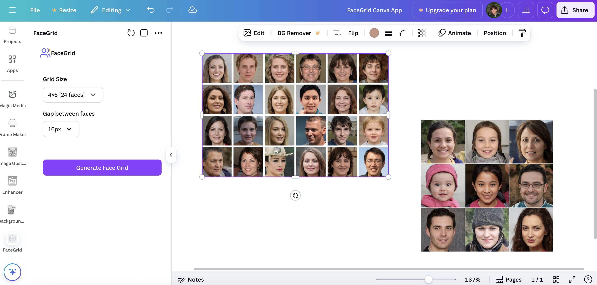

# FaceGrid AI Gallery 🎭

[](https://vercel.com/new/clone?repository-url=https%3A%2F%2Fgithub.com%2Fjuleslemee%2FFaceGrid)
[](https://choosealicense.com/licenses/mit/)
[](https://reactjs.org/)
[](https://www.typescriptlang.org/)

Generate professional grids of AI-generated faces perfect for mockups, presentations, and design projects.

## Demo


## Features

- 🎯 **Multiple Grid Sizes** - From 3x3 (9 faces) to 10x15 (150 faces)
- ⚡ **Real-time Generation** - Watch faces appear with live progress tracking
- 📥 **Dual Download Options** - Bordered grids for structure, borderless for seamless integration
- 🚀 **No Registration Required** - Start generating immediately
- 💼 **Copyright-Free** - Use in any project without legal concerns

## Integrations (Coming Soon)

<div align="center">
  <table>
    <tr>
      <td align="center">
        <h3>Canva Plugin <em>(Pending Approval)</em></h3>
        
      </td>
      <td align="center">
        <h3>Figma Plugin <em>(Pending Approval)</em></h3>
        
      </td>
    </tr>
  </table>
</div>

## Quick Start

### Try It Online
**[facegrid.juleslemee.com](https://facegrid.juleslemee.com)**

### Local Development
```bash
git clone https://github.com/juleslemee/FaceGrid.git
cd FaceGrid
npm install
npm run dev
```

## Use Cases

- **UI/UX Design** - Mockups, prototypes, user personas
- **Presentations** - Customer demographics, team showcases
- **Marketing** - Diverse audience representation, campaign visuals
- **Development** - App testing, portfolio projects

## Tech Stack

- **Frontend:** React, TypeScript, Tailwind CSS, shadcn/ui
- **Backend:** Python, Vercel Functions
- **Tools:** Vite, Lucide Icons

## Contributing

Contributions welcome! Feel free to report bugs, suggest features, or submit pull requests.

## License

MIT License - See [LICENSE](LICENSE) for details.

---

*Made with 💙 by [Jules Lemée](https://juleslemee.com)*